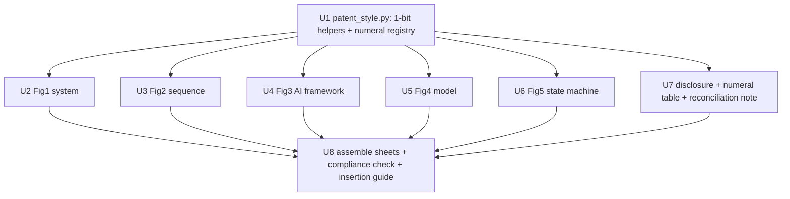

# feat: Patent CAP (ACN1408) AI framework, model diagram & 2D-line drawings package

## Summary

Build a reproducible `patent_cap/` deliverable for the ACN1408 Complete Specification: a matplotlib-based **1-bit black-line-art** toolkit + a shared reference-numeral registry, then five compliant 2D-line figures (system, sequence, AI framework, BiLSTM+Attention model, vehicle-control state machine), an enablement-level disclosure text, a **provisional↔code reconciliation note**, and a python-docx assembly that lays each figure on a labeled sheet — all pure black-on-white line art (no greyscale) with consistent reference numerals, with every technical claim traced to the as-built code.

> **Doc-review round 1 (2026-06-12)** corrected three P1s in the first draft: (1) the compliance check passed on anti-aliased greyscale (empirically: ~3–4k mid-grey pixels, 0 chromatic) — the rendering must be 1-bit/vector and the check must test greyscale, not just chroma; (2) the CAP mirroring the code would contradict the provisional's claims (real EDA sensor, transdermal sensing, dynamic/personalized thresholds, large-scale datasets) — a reconciliation note is now an explicit deliverable; (3) stale `22 KB`/`AES-256` labels in the source TikZ would leak into the figures — the anti-stale guard now covers figure scripts. See Key Decisions and the per-unit notes.

---

## Problem Frame

The provisional for ACN1408 leaves the AI as a black box and Figure 1 uses disallowed photographs; the patent office requires complete technical disclosure with **2D line diagrams only** before **2026-06-27**. The authoritative content exists in the repo but has never been rendered into patent-grade line drawings or enablement text — and, critically, the as-built system diverges from several provisional claims, so a code-faithful CAP must be reconciled against the provisional before filing. See origin for the full framing and the verified model architecture.

---

## Requirements

- R1. AI-framework / signal-processing pipeline diagram (2D line). *(origin R1)*
- R2. ML model-architecture diagram (BiLSTM + Attention, 2D line). *(origin R2)*
- R3. Enablement-level explanation text tied to reference numerals. *(origin R3)*
- R4. Redraw Figure 1 (system architecture) as compliant 2D line-art (remove photos). *(origin R4)*
- R5. Redraw Figure 2 (sequence) as compliant 2D line-art (current one is a color raster). *(origin R5)*
- R6. Vehicle-control safety state-machine figure (2D line). *(origin R6 — confirmed in scope: full CAP package)*
- R7. One consistent reference-numeral scheme across all figures + the text, with a lookup table. *(origin R7)*
- R8. Each figure as a patent-compliant **pure black-on-white** line-art file (vector + 1-bit raster), one per labeled sheet. *(origin R8)*
- R9. Drop-in disclosure section + numeral table + provisional-reconciliation note in `patent_cap/`. *(origin R9)*

**Origin actors:** A1 (patent examiner — requires 2D-line, enablement disclosure), A2 (applicant/inventors — deadline 2026-06-27), A3 (patent agent — consumes the AI section + drawings + reconciliation note)

---

## Scope Boundaries

- No full legal Complete Specification (claims, abstract, full prose) — only the AI disclosure section + drawings package + reconciliation note (origin: owned by the patent agent A3).
- No color or greyscale-shaded figures — strictly pure black line art on white (1-bit / vector).
- No invented model details — diagrams mirror `ml_model/training/bac_estimation_model.py`; divergences from the provisional are reconciled, not silently mirrored.
- Composition-% / biological-resource disclosures treated as N/A (origin assumption).
- This package does not *resolve* provisional contradictions — it *surfaces* them for the patent agent (A3); rewording the provisional/claims is A3's call.

### Deferred to Follow-Up Work

- Reusing/adapting these diagrams for the journal paper (`overleaf_papers/`) — separate effort (origin: Deferred for later).

---

## Context & Research

### Relevant Code and Patterns

- `overleaf_papers/nn_architecture.tikz` — authoritative model-architecture content (Input[B,10,6] → BiLSTM(64)→[B,10,128] → Dropout(0.3) → attention {Dense(1)·tanh → Softmax[B,10] → ⊗ Multiply → Sum} → Dense(32)·relu → Dropout → Dense(16)·relu → Dense(1)·linear → BAC). Verified to match `ml_model/training/bac_estimation_model.py` (penalty `* 30.0` at ~line 101).
- `overleaf_papers/system_architecture.tikz` — system content, **but carries stale labels** (`22 KB TFLite`, `AES-256, 30s`) that must NOT be copied (see Key Decisions / U2).
- `overleaf_papers/sequence_diagram.tikz` — sequence content (the embedded `Drawings_ACN1408.docx` Figure 2 is a color raster, ~100k chromatic pixels → full redraw needed).
- `scripts/generate_paper_figures.py` — existing matplotlib figure pattern (`matplotlib.use('Agg')`, PDF+PNG export). Mirror its structure; override the styling for 1-bit line art.
- `CLAUDE.md` — system pipeline, BLE protocol, Arduino state machine, **and Known Limitations** (EDA estimated from HRV, AES-256 spec-only, synthetic training data) — the source of the provisional divergences.
- `ml_model/training/bac_estimation_model.py` — `ClimateAdaptiveModel.calibrate_prediction` is a **post-inference** wrapper (also `applyClimateCalibration` in `BACInferenceEngine.kt`), NOT a layer in the trained TFLite graph.
- `Sudhanshu_papers/ACN1408 Prov._Patent_130625 (1).docx` — provisional text: claims a real EDA sensor, "transdermal alcohol concentrations", dynamic/personalized thresholds, large-scale datasets — items the as-built code does not match (reconciliation in U7).
- `Sudhanshu_papers/Drawings_ACN1408.docx` — current non-compliant figures + sheet header field labels to reuse.

### Institutional Learnings

- No `docs/solutions/` directory — no prior learnings to carry.
- Memory: `project_patent_cap_acn1408`, `project_repo_cleanup_2026_06`.

### External References

- None required — content sourced from the repo; patent drawing conventions captured in Key Decisions. (Primary-source Indian Patent Rules clauses on greyscale/text-in-figures were not quoted; the no-greyscale stance rests on the office's stated "2D line diagrams only" + standard black-line-art convention.)

---

## Key Technical Decisions

- **Render pure 1-bit black line art, not just "no color"** — anti-aliased matplotlib output is chromatically neutral but full of mid-grey pixels (empirically ~3–4k greys / 200+ levels at 300 DPI), which reads as the halftone shading patents prohibit. So: draw with `antialiased=False`, black strokes, `facecolor='none'`; export a **vector PDF** (primary, crisp line art) **and** a **1-bit binarized PNG** (`PIL .convert('1')`) for docx embedding. The compliance test asserts the PNG is genuinely bilevel (negligible mid-grey fraction), not merely grey-free.
- **Render with matplotlib (+PIL), not Graphviz/TikZ** — `matplotlib`/`PIL`/`python-docx` are installed; `dot`, LaTeX, `cairosvg`, `svgwrite` are not. matplotlib patches + arrows + the 1-bit pipeline above produce compliant line art reproducibly.
- **A provisional↔code reconciliation note is a first-class deliverable** — a CAP that mirrors the code will contradict/narrow the provisional (EDA *estimated* not sensed; no transdermal sensor; threshold hardcoded at 0.08 vs "dynamic/personalized"; synthetic training data vs "large-scale datasets"; AES-256 spec-only). The package surfaces these deltas for A3 rather than silently asserting either side.
- **Anti-stale guard covers figure scripts, not just text** — forbid the literal labels `22 KB`, `AES-256` (as-implemented), and `5×` in `gen/*.py`; the BLE link is labeled "secure BLE link (AES-256 per spec)" and the model is described per current code (no `22 KB`).
- **Climate calibration is post-inference** — numeral 132 is depicted as a deterministic correction applied to the model's raw BAC output (fixed temp/humidity coefficients), shown distinct from the trained network in Fig 3 and **absent** from the Fig 4 model graph.
- **Shared toolkit + single numeral registry (U1)** — one module fixes line weight/font/box/arrow style and is the single source of truth for reference numerals; `validate()` runs at import (no separate smoke-test file).
- **`patent_cap/` deliverable container; one figure per regenerated sheet via python-docx** — headers reconstructed per page (Total sheets = 5, Sheet no = N, Figure no = N), reusing the existing field labels/styling (the source doc is single-sheet, so "mirror" = reuse labels, not layout).
- **Reference-numeral scheme = 100-series by subsystem** (full table in U7): 100 system; 110 smartwatch (112 PPG, 114 EDA[estimated], 116 temp, 118 on-device inference); 120 AI module (122 preprocessing/windowing, 124 feature tensor [10×6], 126 BiLSTM, 128 attention, 130 dense head, 132 post-inference climate calibration); 140 secure BLE link; 150 vehicle controller (152 BLE receiver, 154 safety logic, 156 relay/MOSFET); 160 ignition/OBD-II/ECU; 170 indicators; 180 override.

---

## Open Questions

### Resolved During Planning

- Rendering toolchain / compliance? → matplotlib `antialiased=False` → vector PDF + 1-bit PNG (PIL `.convert('1')`); compliance test asserts bilevel, not just grey-free.
- Output container? → new `patent_cap/` folder.
- Reference-numeral scheme? → 100-series by subsystem (above); full table in U7.
- Include the state-machine figure (origin R6)? → Yes (user confirmed full CAP package).
- Penalty notation in text? → exact `30×` (matches code `* 30.0`), not `~30×`.

### Deferred to Implementation

- Exact box/arrow coordinates and label placement per figure — layout resolved while rendering.
- Whether the office accepts raster (1-bit PNG) line-art at the chosen DPI or requires vector PDF on the sheet — python-docx embeds PNG; the vector PDF is delivered alongside. Flag in INSERTION_GUIDE for A3.
- Final wording of each provisional-reconciliation delta — drafted in U7, but the authoritative reconciliation (keep code framing vs amend provisional) is A3's decision.

---

## Output Structure

    patent_cap/
      patent_style.py            # 1-bit line-art helpers + numeral registry + validate() (U1)
      reference_numerals.md      # numeral -> component lookup table (U7)
      figures/
        fig1_system_architecture.{pdf,png}     # U2  (png is 1-bit)
        fig2_sequence.{pdf,png}                 # U3
        fig3_ai_framework.{pdf,png}             # U4
        fig4_model_architecture.{pdf,png}       # U5
        fig5_vehicle_state_machine.{pdf,png}    # U6
      gen/
        fig1_system_architecture.py             # U2
        fig2_sequence.py                        # U3
        fig3_ai_framework.py                    # U4
        fig4_model_architecture.py              # U5
        fig5_vehicle_state_machine.py           # U6
      disclosure_ai_section.md     # enablement drop-in text for the Complete Specification (U7)
      provisional_reconciliation.md# code-vs-provisional deltas for the patent agent (U7)
      Drawings_ACN1408_CAP.docx    # assembled, one figure per labeled sheet (U8)
      INSERTION_GUIDE.md           # how A3 inserts figures/text into the Form-2 filing (U8)
      check_compliance.py          # asserts bilevel B/W + numeral consistency + no stale labels (U8)

---

## High-Level Technical Design

> *This illustrates the intended approach and is directional guidance for review, not implementation specification. The implementing agent should treat it as context, not code to reproduce.*



Figure 4 (model) — drawn as 1-bit line-art from `nn_architecture.tikz` / the code; climate calibration (132) is NOT a layer here:

```
[124 feature tensor B x10x6] -> [126 BiLSTM(64) -> B x10x128] -> [Dropout 0.3]
   -> attention(128): [Dense(1) tanh] -> [Softmax B x10] -> [(x) Multiply] -> [Sum -> 128]
   -> [Dense(32) ReLU] -> [Dropout] -> [Dense(16) ReLU] -> [Dense(1) linear -> BAC]
```

---

## Implementation Units

### U1. 1-bit line-art toolkit + reference-numeral registry

**Goal:** A shared module giving every figure pure black-on-white line art (no greyscale) and a single reference-numeral registry used by all figures and the text.

**Requirements:** R7, R8

**Dependencies:** None

**Files:**
- Create: `patent_cap/patent_style.py`

**Approach:**
- Helpers: `box(ax, xy, w, h, label, numeral)`, `arrow(ax, src, dst)`, `numeral(ax, xy, n, leader=True)`, `new_sheet(figsize)`, `save(fig, name)`.
- `save` exports a **vector PDF** and a **1-bit PNG**: render with `antialiased=False`, black strokes, `facecolor='none'`, then binarize the PNG via `PIL.Image.convert('1')` (Floyd-Steinberg off / threshold) so the raster is genuinely bilevel.
- `NUMERALS`: dict literal encoding the 100-series scheme (single source of truth); `n(key)` returns the integer; `validate()` asserts uniqueness and runs at import (no separate smoke-test file).
- `matplotlib.use('Agg')`; mirror `scripts/generate_paper_figures.py` export conventions, overriding the style for 1-bit.

**Patterns to follow:** `scripts/generate_paper_figures.py` (Agg, export); patent black-line-art convention.

**Test scenarios:**
- Happy path: `box`/`arrow`/`numeral` then `save` writes a `.pdf` and a `.png`, both non-empty.
- Edge case (load-bearing): the saved PNG is genuinely **bilevel** — the fraction of pixels with luminance in 30..225 is below a small tolerance (this is the real compliance invariant; "no chromatic pixels" alone is insufficient because anti-aliased black is grey).
- Edge case: `validate()` raises if two components share a numeral.

**Verification:**
- A rendered sample PNG is bilevel (near-zero mid-grey), the PDF is vector line art, and `validate()` passes on the real registry.

---

### U2. Figure 1 — System architecture (compliant redraw)

**Goal:** Replace the photo-based Figure 1 with a 1-bit line-art block diagram of the data flow, numeral-labeled, free of stale labels.

**Requirements:** R4, R7, R8

**Dependencies:** U1

**Files:**
- Create: `patent_cap/gen/fig1_system_architecture.py`, `patent_cap/figures/fig1_system_architecture.{pdf,png}`

**Approach:**
- Blocks: smartwatch (110) with sensors (112 PPG, 114 EDA[estimated], 116 temp) → AI module (120) → secure BLE link (140) → vehicle controller (150: 152 receiver, 154 logic, 156 relay) → ignition/OBD-II/ECU (160); indicators (170), override (180). Labeled rectangles only — no photographs.
- Source from `system_architecture.tikz` **but scrub stale labels**: do NOT carry `22 KB TFLite` or `AES-256` as implemented facts; label the link "secure BLE link (AES-256 per spec)". Do not depict biometric authentication unless it exists in the embodiment (it is not in the model — see U7 reconciliation).

**Patterns to follow:** `system_architecture.tikz` (flow only); U1 helpers.

**Test scenarios:**
- Happy path: script runs headless, writes `fig1_system_architecture.pdf` + 1-bit `.png`.
- Edge case: every block numeral comes from `NUMERALS` (no literal/orphan numbers).
- Error path: the figure script contains none of the forbidden literals `22 KB`, `AES-256` (bare), `5×`.

**Verification:**
- B/W line-art, no embedded photo, no stale labels; all blocks numeral-labeled and registry-traceable.

---

### U3. Figure 2 — Sequence diagram (full redraw)

**Goal:** Redraw the sequence diagram as compliant 1-bit line-art (the existing Figure 2 is a color raster, not line art).

**Requirements:** R5, R7, R8

**Dependencies:** U1

**Files:**
- Create: `patent_cap/gen/fig2_sequence.py`, `patent_cap/figures/fig2_sequence.{pdf,png}`

**Approach:**
- Lifelines: smartwatch sensors (110), AI/BAC module (120), secure BLE (140), vehicle module (150); steps mirror the existing sequence (continuous data → BAC calc → threshold → alert → block → verification → recheck → maintain block). **Full redraw** (the embedded image2.png is a ~1280×894 color raster, ~100k chromatic pixels) — do not re-embed the existing raster.
- Source content: `sequence_diagram.tikz` + the existing figure's step list.

**Patterns to follow:** `sequence_diagram.tikz`; U1 helpers.

**Test scenarios:**
- Happy path: script writes `fig2_sequence.pdf` + 1-bit `.png`.
- Edge case: lifeline numerals match Figures 1/3/4/5 for the same components.

**Verification:**
- 1-bit line-art sequence; actor numerals match the registry and the other figures; no carried-over raster.

---

### U4. Figure 3 — AI framework / signal-processing pipeline (new)

**Goal:** Disclose the end-to-end AI pipeline as a 1-bit process-flow diagram, with calibration shown as post-inference.

**Requirements:** R1, R7, R8

**Dependencies:** U1

**Files:**
- Create: `patent_cap/gen/fig3_ai_framework.py`, `patent_cap/figures/fig3_ai_framework.{pdf,png}`

**Approach:**
- Flow: sensor acquisition (112/114/116) → preprocessing & 10-timestep windowing (122) → feature tensor [10×6] (124) → BiLSTM+Attention inference (126/128) → **post-inference** climate-adaptive calibration (132, drawn as a distinct correction box applied to the model's raw BAC output, not as a network layer) → BAC estimate → threshold/decision (0.08 g/dL, 154) → confidence/alert + secure BLE status (140) → ignition control (156/160). Process boxes + directional arrows.

**Patterns to follow:** U1 helpers; `CLAUDE.md` pipeline; `ClimateAdaptiveModel.calibrate_prediction` / `applyClimateCalibration` (post-inference placement).

**Test scenarios:**
- Happy path: script writes `fig3_ai_framework.pdf` + 1-bit `.png`.
- Edge case: the 0.08 g/dL threshold and [10×6] feature shape appear and match the code.
- Edge case: calibration (132) is visually separated from the trained-inference block (126/128), not inside it.

**Verification:**
- 1-bit pipeline figure; each stage numeral-labeled; calibration shown as post-processing; matches the implemented data flow.

---

### U5. Figure 4 — BiLSTM + Attention model architecture (new)

**Goal:** Disclose the network architecture as a 1-bit layer diagram faithful to the code; calibration excluded.

**Requirements:** R2, R7, R8

**Dependencies:** U1

**Files:**
- Create: `patent_cap/gen/fig4_model_architecture.py`, `patent_cap/figures/fig4_model_architecture.{pdf,png}`

**Approach:**
- Layers (with shapes): Input [B,10,6] (124) → BiLSTM(64) → [B,10,128] (126) → Dropout(0.3) → attention (128): Dense(1)·tanh → Softmax [B,10] → ⊗ Multiply → Sum → context [128] → Dense(32)·ReLU (130) → Dropout → Dense(16)·ReLU → Dense(1)·linear → BAC. Translate `nn_architecture.tikz` to 1-bit line-art (drop color fills). The network ends at the Dense head — climate calibration (132) is NOT shown here.

**Patterns to follow:** `nn_architecture.tikz` (structure); `bac_estimation_model.py` (ground truth); U1 helpers.

**Test scenarios:**
- Happy path: script writes `fig4_model_architecture.pdf` + 1-bit `.png`.
- Edge case: layer set/shapes exactly match `bac_estimation_model.py` (BiLSTM 64→128, Dense 32/16/1, dropout 0.3); no invented layers; numeral 132 absent.
- Edge case: attention sub-path (Dense(1)·tanh → Softmax → Multiply → Sum) is a distinct branch.

**Verification:**
- 1-bit model figure; every layer/shape traceable to the code; attention branch explicit; no calibration layer.

---

### U6. Figure 5 — Vehicle-control safety state machine (new)

**Goal:** Disclose the fail-safe ignition control logic as a 1-bit state diagram.

**Requirements:** R6, R7, R8

**Dependencies:** U1

**Files:**
- Create: `patent_cap/gen/fig5_vehicle_state_machine.py`, `patent_cap/figures/fig5_vehicle_state_machine.{pdf,png}`

**Approach:**
- States: IGNITION_BLOCKED (default/initial, 154), IGNITION_ALLOWED, WAITING_FOR_DATA, CONNECTION_LOST, OVERRIDE_ACTIVE. Transitions: BAC<0.08 & watch worn & recent → ALLOWED; 60 s timeout → CONNECTION_LOST → BLOCKED; watch removed / stale → BLOCKED; 5 s override hold → OVERRIDE_ACTIVE (5 min, logged) → BLOCKED. Source: `CLAUDE.md` "Arduino Safety Logic".

**Patterns to follow:** `CLAUDE.md` state machine; U1 helpers.

**Test scenarios:**
- Happy path: script writes `fig5_vehicle_state_machine.pdf` + 1-bit `.png`.
- Edge case: BLOCKED is the default/initial state (fail-safe); every transition has a labeled condition.

**Verification:**
- 1-bit state figure; states/transitions match `CLAUDE.md`; fail-safe default visible.

---

### U7. Disclosure text, numeral table & provisional-reconciliation note

**Goal:** Enablement-level drop-in text, the numeral lookup table, and a code-vs-provisional reconciliation note — authored from the registry + sources (does not require rendered figures).

**Requirements:** R3, R7, R9

**Dependencies:** U1

**Files:**
- Create: `patent_cap/disclosure_ai_section.md`, `patent_cap/reference_numerals.md`, `patent_cap/provisional_reconciliation.md`

**Approach:**
- `disclosure_ai_section.md`: patent-style enablement text citing numerals — AI framework (Fig 3), model architecture and each layer's role (Fig 4), the safety-prioritized asymmetric loss (false negatives penalized **30×**, matching `* 30.0` in code), **post-inference** climate-adaptive calibration, on-device TFLite quantized deployment (LSTM requires SELECT_TF_OPS), and system + state-machine operation (Figs 1, 2, 5). No stale `5×`/`22 KB`; EDA described as **estimated/derived** (not directly sensed); BAC **inferred from physiological proxies**, not transdermal sensing; training data described honestly (synthetic physiologically-modeled).
- `reference_numerals.md`: table generated from the `NUMERALS` registry (numeral → component).
- `provisional_reconciliation.md`: enumerate deltas between the as-built code and the provisional for A3 — EDA estimated vs "EDA sensor"; no transdermal sensor vs "transdermal alcohol concentrations"; hardcoded 0.08 threshold vs "dynamic/personalized thresholds"; synthetic data vs "large-scale physiological datasets"; AES-256 spec-only vs implemented; biometric-authentication mention vs absent in model. For each: what the code/embodiment does, what the provisional says, and the recommended framing.

**Patterns to follow:** `ACN1408 Prov._Patent_130625 (1).docx` register/voice; `CLAUDE.md` Known Limitations; the `NUMERALS` registry.

**Test scenarios:**
- Happy path: every numeral cited in `disclosure_ai_section.md` exists in `reference_numerals.md` and vice-versa (no orphans).
- Edge case: metrics/architecture in the text match the code (30× loss, layer shapes); no `5×`/`22 KB`.
- Edge case: each provisional delta in `provisional_reconciliation.md` cites both the code/CLAUDE.md fact and the provisional phrase.

**Verification:**
- Disclosure reads at enablement level, every component cited by a registry numeral; numeral table complete; reconciliation note surfaces all known code-vs-provisional deltas for A3.

---

### U8. Assemble drawing sheets, compliance check & insertion guide

**Goal:** Produce the filing-ready drawings document (one figure per labeled sheet), an automated compliance check, and an insertion guide.

**Requirements:** R8, R9

**Dependencies:** U2, U3, U4, U5, U6, U7

**Files:**
- Create: `patent_cap/Drawings_ACN1408_CAP.docx`, `patent_cap/check_compliance.py`, `patent_cap/INSERTION_GUIDE.md`
- Modify: none (the existing `Sudhanshu_papers/Drawings_ACN1408.docx` is left intact)

**Approach:**
- Via `python-docx`, build a fresh drawings doc placing each 1-bit figure PNG on its own page with a reconstructed header per sheet (Applicant name, **Total no. of sheets = 5**, **Sheet no = N**, **Figure no = N**) reusing the existing field labels/styling, page break between figures. (The source doc packs two figures on one sheet, so this is a reconstruction, not a copy.)
- `check_compliance.py` (keep — the by-construction argument fails: anti-aliasing produces grey): asserts every `figures/*.png` is **bilevel** (mid-grey fraction below tolerance, not merely chroma-free), all five figures present, every registry numeral referenced by ≥1 figure script and the disclosure text, and no forbidden stale literal (`22 KB`, bare `AES-256`, `5×`) appears in `gen/*.py` or `disclosure_ai_section.md`.
- `INSERTION_GUIDE.md`: where each figure/sheet, the disclosure section, and the reconciliation note go in the Form-2 Complete Specification; flags the PNG-vs-vector-PDF question and the provisional deltas for A3 (A2 as fallback reader).

**Patterns to follow:** `Sudhanshu_papers/Drawings_ACN1408.docx` header field labels; `python-docx`.

**Test scenarios:**
- Happy path: `Drawings_ACN1408_CAP.docx` opens with 5 labeled sheets, one figure each, headers numbered 1–5 of 5.
- Edge case: `check_compliance.py` fails loudly on a non-bilevel figure, an orphaned numeral, or a stale literal.
- Integration: regenerating all figures (U2–U6) then re-running assembly reproduces the docx deterministically.

**Verification:**
- The docx is filing-ready (1-bit line-art, labeled sheets); compliance check passes on real outputs; insertion guide + reconciliation note let A3 assemble the CAP before 2026-06-27.

---

## System-Wide Impact

- **Interaction graph:** Self-contained new `patent_cap/` directory; no runtime code paths, models, or app behavior change. Reads existing TikZ/`CLAUDE.md`/code/provisional only as content sources.
- **Unchanged invariants:** `ml_model/`, `wear_os_app/`, `arduino/`, `overleaf_papers/`, and the original `Sudhanshu_papers/Drawings_ACN1408.docx` are not modified.
- **Accuracy risk surface:** the figures/text assert technical facts for a legal filing — every claim traces to the code/`CLAUDE.md`, enforced by U7 (honest descriptions + reconciliation) and U8 (bilevel + stale-literal + numeral checks).

---

## Risks & Dependencies

| Risk | Mitigation |
|------|------------|
| Figures pass a "no color" check but carry anti-aliased greyscale shading (patent-prohibited) | Render `antialiased=False` → vector PDF + 1-bit PNG (`PIL .convert('1')`); `check_compliance.py` asserts **bilevel**, not just chroma-free (U1, U8) |
| CAP (code-faithful) contradicts the provisional (EDA sensor, transdermal, dynamic thresholds, datasets) | `provisional_reconciliation.md` surfaces every delta for A3; disclosure text uses honest framing (EDA estimated, proxies, synthetic data) (U7) |
| Stale `22 KB`/`AES-256` labels in source TikZ leak into figures | Anti-stale guard forbids those literals in `gen/*.py`; BLE labeled "secure (AES-256 per spec)" (U2, U8) |
| Diagram contradicts the as-built model (legal accuracy) | Fig 4 sourced from `nn_architecture.tikz` + `bac_estimation_model.py`; U7/U8 assert shapes/metrics match code; calibration drawn as post-inference, not a layer |
| Existing Figure 2 mistaken for compliant line-art | U3 does a full redraw; the existing color raster is never re-embedded |
| Office may require vector (PDF) on the sheet vs embedded PNG | Vector PDFs delivered alongside; INSERTION_GUIDE flags the choice for A3 |
| Deadline 2026-06-27 | U2–U6 and U7 are all independent after U1 (parallelizable); only U8 assembles |

---

## Documentation / Operational Notes

- `patent_cap/INSERTION_GUIDE.md` + `provisional_reconciliation.md` are the hand-off artifacts for the patent agent (A3): figure/sheet placement, disclosure-text placement, and the code-vs-provisional deltas to resolve before filing.
- Everything is regenerable (`gen/*.py` + `patent_style.py`), so late corrections re-render deterministically before filing.

---

## Sources & References

- **Origin document:** docs/brainstorms/2026-06-12-patent-cap-ai-disclosure-requirements.md
- Doc-review round 1 (2026-06-12): feasibility + adversarial P1 (greyscale compliance, empirically measured), adversarial P1 (provisional contradictions, stale figure labels), coherence (penalty notation), scope-guardian (U7 parallelism, test-file trimming)
- Content sources: `overleaf_papers/nn_architecture.tikz`, `overleaf_papers/system_architecture.tikz`, `overleaf_papers/sequence_diagram.tikz`, `ml_model/training/bac_estimation_model.py`, `wear_os_app/.../BACInferenceEngine.kt`, `CLAUDE.md`, `Sudhanshu_papers/` (provisional + current drawings)
- Toolkit pattern: `scripts/generate_paper_figures.py`
- Memory: `project_patent_cap_acn1408`
