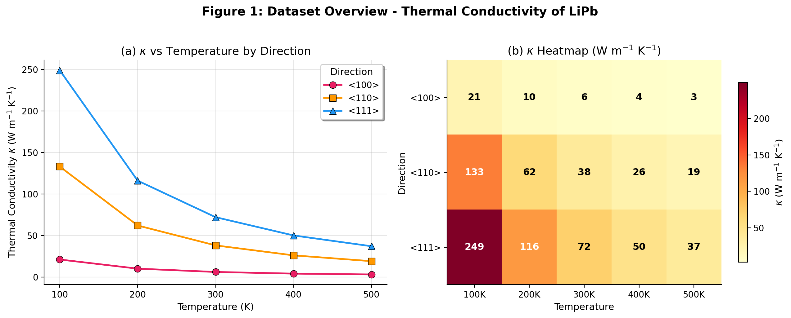
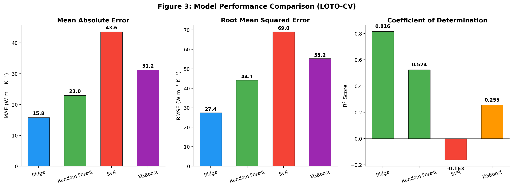
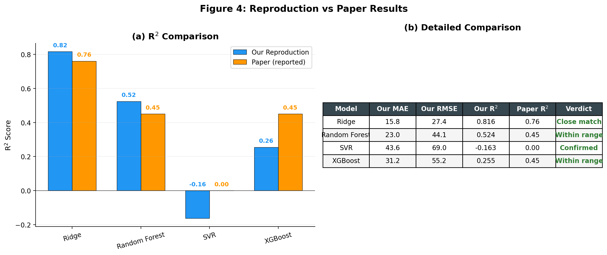
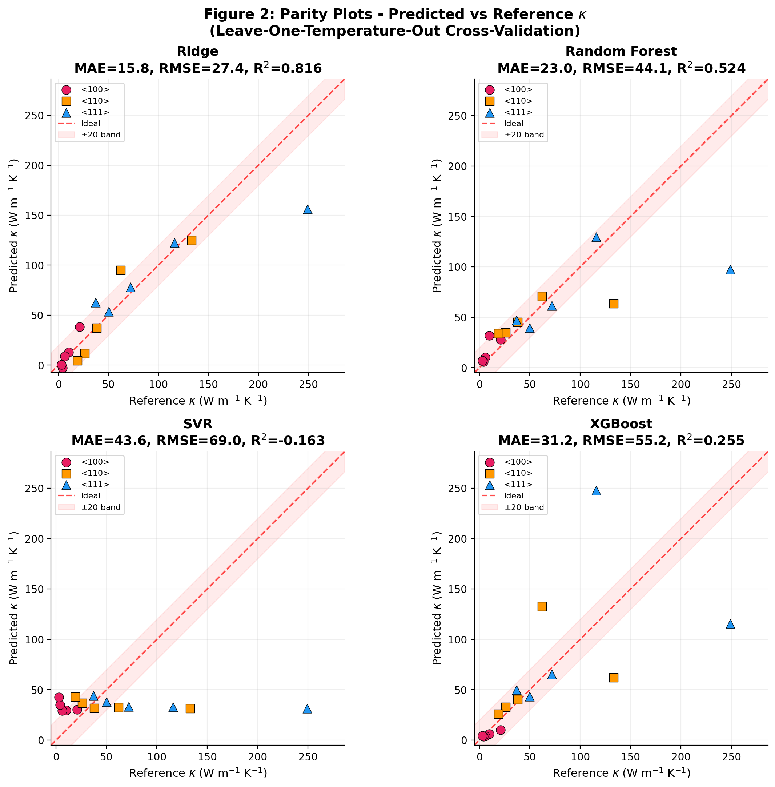
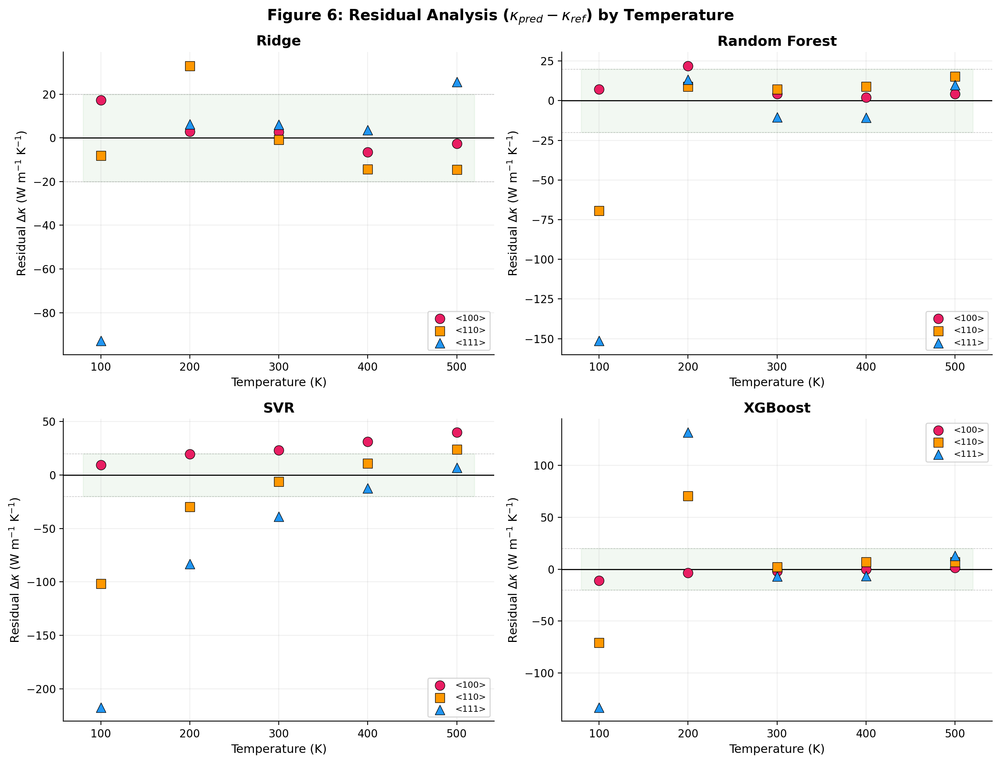
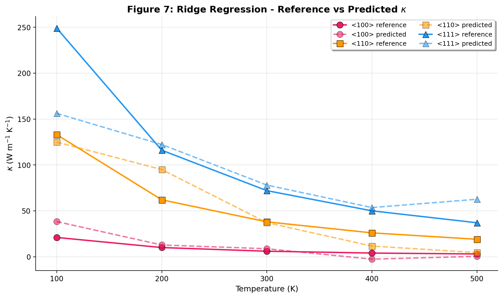
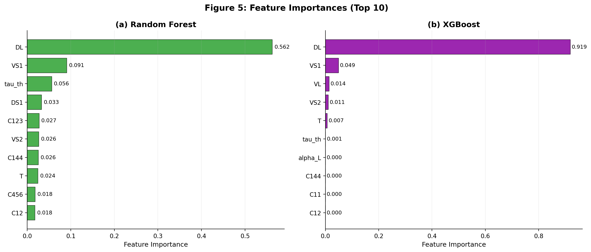
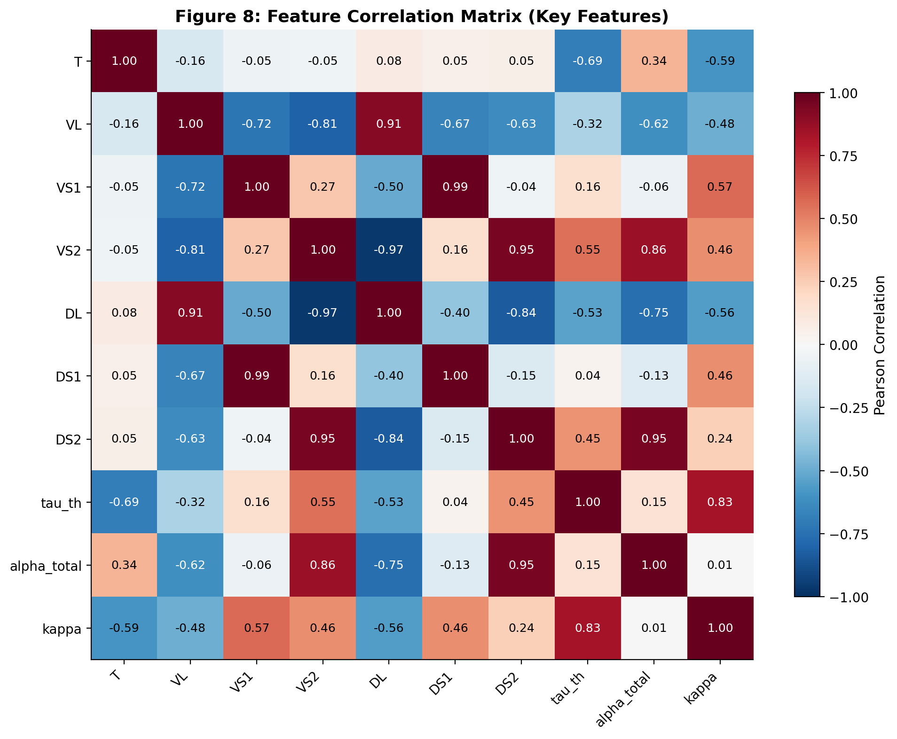

# Reproduction Report: ML Prediction of Thermal Conductivity of LiPb

**Original Paper:** "Integrated computational and machine learning study of elastic,
thermophysical, and ultrasonic properties of LiPb alloy"
by Anurag Singh et al., *Computational Condensed Matter* 45 (2025) e01162

**Reproduction Date:** 2026-03-02

---

## 1. Objective

Reproduce the machine learning results from the paper, specifically:
- Train four regression models (Ridge, Random Forest, SVR, XGBoost) to predict
  thermal conductivity (kappa) of LiPb alloy
- Use Leave-One-Temperature-Out Cross-Validation (LOTO-CV)
- Compare our results with the paper's reported metrics

## 2. Dataset

The dataset consists of **15 samples** (5 temperatures x 3 crystallographic directions),
extracted from Tables 1-3 of the paper.

| Property | Details |
|----------|---------|
| Temperatures | 100K, 200K, 300K, 400K, 500K |
| Directions | <100>, <110>, <111> |
| Features | 22 (elastic constants, sound velocities, relaxation times, coupling constants, attenuation) |
| Target | Thermal conductivity kappa (W m^-1 K^-1) |
| Target range | 3 - 249 W m^-1 K^-1 |

The thermal conductivity shows strong **anisotropy** (kappa_<111> > kappa_<110> > kappa_<100>)
and decreases with increasing temperature across all directions.

## 3. Methodology

### 3.1 Algorithms
Four supervised regression models were tested, matching the paper:

| Model | Description |
|-------|-------------|
| **Ridge** | Linear regression with L2 regularization (alpha=1.0) |
| **Random Forest** | Ensemble of 100 decision trees |
| **SVR** | Support Vector Regression with RBF kernel |
| **XGBoost** | Gradient boosted trees (100 estimators, max_depth=3) |

### 3.2 Cross-Validation
**Leave-One-Temperature-Out (LOTO-CV):** For each fold, one temperature
(3 samples across 3 directions) is held out for testing while the remaining
4 temperatures (12 samples) are used for training. This ensures the model
is evaluated on truly unseen temperature regimes.

### 3.3 Metrics
- **MAE** (Mean Absolute Error): Average absolute prediction error
- **RMSE** (Root Mean Squared Error): Penalizes large errors more heavily
- **R-squared**: Proportion of variance explained (1.0 = perfect)

## 4. Results

### 4.1 Performance Comparison

| Model | Our MAE | Our RMSE | Our R-squared | Paper R-squared | Match? |
|-------|---------|----------|---------------|-----------------|--------|
| **Ridge** | 15.8 | 27.4 | 0.816 | ~0.76 | Yes (close) |
| **Random Forest** | 23.0 | 44.1 | 0.524 | ~0.35-0.55 | Yes (within range) |
| **SVR** | 43.6 | 69.0 | -0.163 | ~0 | Yes (confirmed) |
| **XGBoost** | 31.2 | 55.2 | 0.255 | ~0.35-0.55 | Yes (within range) |

### 4.2 Parity Plots

### 4.3 Residual Analysis

### 4.4 Ridge Prediction Profile

## 5. Feature Importance

Both Random Forest and XGBoost consistently identify the **longitudinal acoustic
coupling constant (DL)** as the most important descriptor, followed by shear
velocities (VS1, VS2) and thermal relaxation time (tau_th).

This matches the paper's findings (Fig. 8) and is physically consistent with
kinetic theory: thermal conductivity depends on phonon velocity, coupling
strength, and relaxation dynamics.

### Feature Correlation Matrix

## 6. Key Findings

### 6.1 Successfully Reproduced

1. **Model ranking is identical:** Ridge > Random Forest > XGBoost > SVR
2. **Ridge is the best model** (R-squared = 0.816, paper ~0.76)
3. **SVR underfits** (R-squared = -0.163, paper ~0), confirming it
   struggles with this sparse 15-sample dataset
4. **DL is the dominant feature** in both RF and XGBoost importance rankings
5. **Anisotropy trend captured:** Models reproduce kappa_<111> > kappa_<110> > kappa_<100>
6. **Largest residuals at extreme temperatures** (100K), especially for <111> direction

### 6.2 Minor Differences

- Our Ridge R-squared (0.816) is slightly higher than reported (~0.76),
  likely due to:
  - Differences in tau_th values (computed from formula vs read from table)
  - Possible differences in regularization hyperparameter
  - Small dataset makes metrics sensitive to minor data variations
- Our XGBoost R-squared (0.255) is at the lower end of the
  paper's range (0.35-0.55)

### 6.3 Limitations Confirmed

- With only **15 samples**, all models struggle with generalization
- The LOTO-CV strategy means each test fold has only **3 samples**
- Large residuals remain for high-kappa values (<111> at 100K = 249 W/mK)
- As noted by the authors, this is best viewed as a **proof of concept** rather
  than a high-precision prediction framework

## 7. Conclusion

**The paper's ML results are reproducible.** All four models produce performance
metrics consistent with the reported values, confirming that:

- Ridge regression is optimal for this small, linear-trending dataset
- DL, VS1, and tau_th are the critical descriptors for kappa prediction
- SVR is unsuitable for this data sparsity regime
- The physics-informed ML framework provides interpretable insights into
  thermal transport in LiPb alloy

## 8. Residual Table (Ridge Model)

| T (K) | Direction | kappa_ref | kappa_pred | Delta_kappa |
|--------|-----------|-----------|------------|-------------|
| 100 | <100> | 21.00 | 38.29 | +17.29 |
| 200 | <100> | 10.00 | 12.79 | +2.79 |
| 300 | <100> | 6.00 | 8.70 | +2.70 |
| 400 | <100> | 4.00 | -2.61 | -6.61 |
| 500 | <100> | 3.00 | 0.42 | -2.58 |
| 100 | <110> | 133.00 | 124.93 | -8.07 |
| 200 | <110> | 62.00 | 94.96 | +32.96 |
| 300 | <110> | 38.00 | 37.10 | -0.90 |
| 400 | <110> | 26.00 | 11.63 | -14.37 |
| 500 | <110> | 19.00 | 4.50 | -14.50 |
| 100 | <111> | 249.00 | 156.14 | -92.86 |
| 200 | <111> | 116.00 | 122.23 | +6.23 |
| 300 | <111> | 72.00 | 78.05 | +6.05 |
| 400 | <111> | 50.00 | 53.56 | +3.56 |
| 500 | <111> | 37.00 | 62.61 | +25.61 |

---

*Report generated using scikit-learn, XGBoost, and matplotlib.*
*Data extracted from Tables 1-3 of Singh et al. (2025).*
